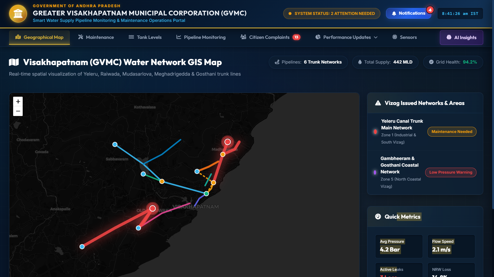
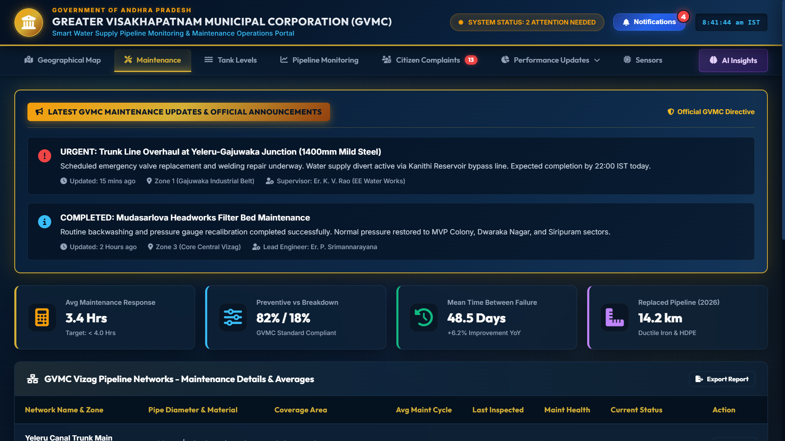
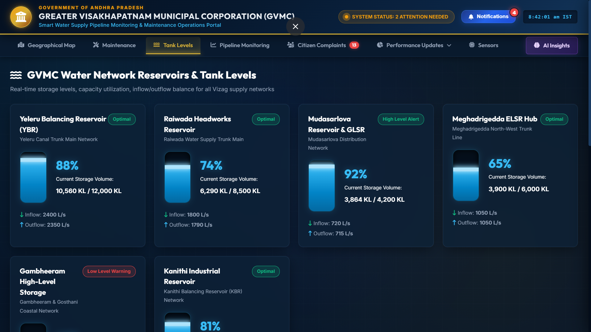
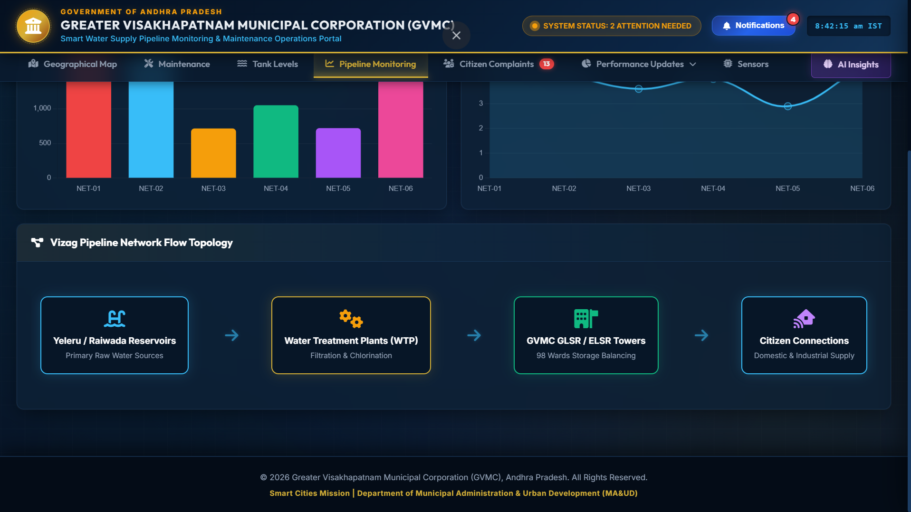
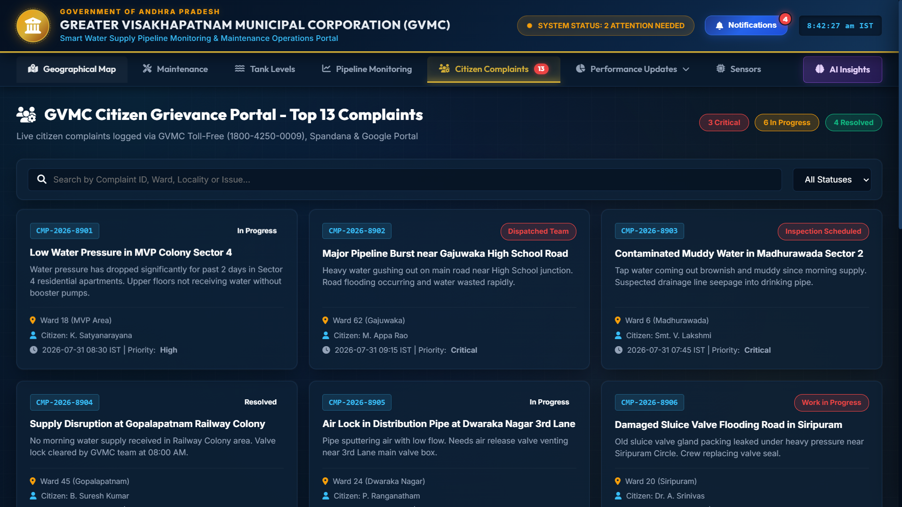
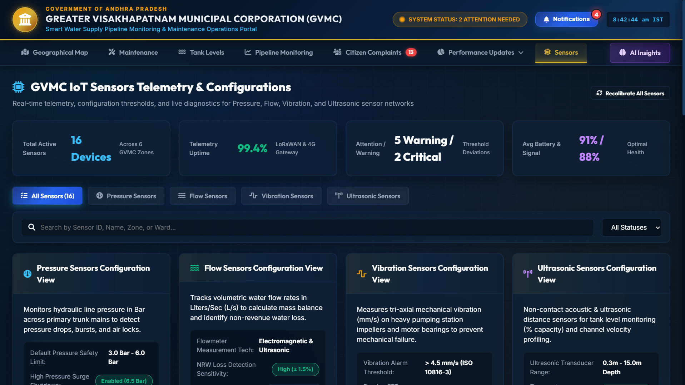
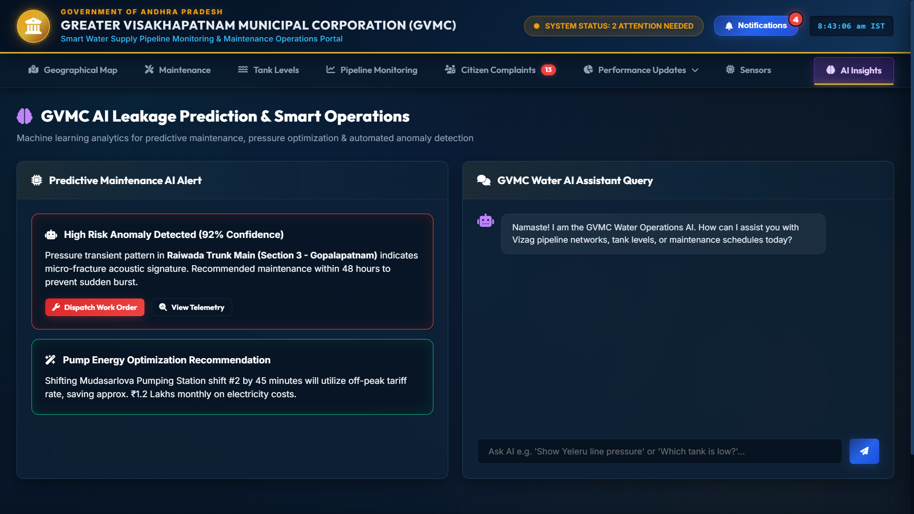

# HydroLens💧

### AI-Powered Smart Water Supply Pipeline Monitoring & Maintenance Platform

**HydroLens** is a smart water-network monitoring and decision-support platform designed to help municipal authorities monitor **water pipelines, reservoirs, IoT sensors, maintenance activities, citizen complaints, and network health** from a unified operations dashboard.

The platform combines **GIS visualization, real-time telemetry, anomaly detection, predictive maintenance, hydraulic monitoring, and AI-assisted decision support** to improve the efficiency and reliability of urban water-supply systems.

---

## 🏆 Hackathon Context

HydroLens was developed as a prototype solution for HackYatra, a multi-state hackathon, addressing a real-world water infrastructure challenge presented in collaboration with the Greater Visakhapatnam Municipal Corporation (GVMC).

🎯 Hackathon Problem

The project was developed to address the challenge of:

Real-Time Pipeline Leakage Detection in the GVMC Distribution Network

GVMC's water distribution network faces challenges such as:

Manual identification of pipeline leakages
Delayed detection of abnormal pressure and flow conditions
Significant water loss through undetected leaks
Limited real-time visibility into pipeline conditions
Difficulty in prioritizing maintenance activities
Lack of a unified monitoring interface for network operations
## 💡 Our Approach

HydroLens was designed as a smart water-network operations and decision-support platform to demonstrate how modern technologies can improve municipal water management.

The prototype combines:

GIS + IoT Sensors + Hydraulic Simulation + AI/ML + Digital Twin + Predictive Maintenance

into a unified dashboard.

The system enables operators to:

Monitor water pipelines geographically.
Observe pressure and flow conditions.
Monitor reservoir and tank levels.
Track IoT sensor telemetry and health.
Detect abnormal network behavior.
Identify potential leakage risks.
Predict infrastructure maintenance requirements.
Track citizen-reported water problems.
Generate AI-assisted operational insights.
Support faster and more informed maintenance decisions.

## 🚀 Problem

Urban water-distribution networks face several operational challenges:

* Pipeline leakage and water loss
* Manual detection of faults
* Pressure and flow abnormalities
* Aging pipeline infrastructure
* Unplanned maintenance
* Reservoir level imbalance
* Sensor failures and unreliable readings
* Delayed response to citizen complaints
* Lack of centralized network visibility

Traditional monitoring systems often operate as separate systems, making it difficult for operators to obtain a complete picture of the water network.

**HydroLens addresses this problem by bringing these operations into a single intelligent monitoring platform.**

---

## 💡 Solution

HydroLens provides a centralized command dashboard for monitoring and managing a municipal water network.

The platform combines:

> **GIS + IoT Telemetry + Hydraulic Monitoring + Predictive Maintenance + AI Insights + Citizen Complaints**

This allows operators to move from **reactive maintenance** toward **data-driven and predictive water-network management**.

---

# 🖥️ Platform Modules

## 🗺️ 1. Geographical Network Map

Provides a spatial visualization of the water distribution network.




### Features

* GIS-based pipeline visualization
* Trunk network monitoring
* Network health indicators
* Supply statistics
* Critical-area identification
* Pipeline issue visualization
* Maintenance-required network highlighting

The map provides operators with a quick overview of the current state of the network.

---

## 🔧 2. Maintenance Operations

The maintenance module provides an operational view of network maintenance activities.


### Features

* Latest maintenance updates
* Emergency maintenance alerts
* Maintenance history
* Pipeline inspection information
* Preventive vs breakdown maintenance
* Mean Time Between Failure (MTBF)
* Pipeline replacement statistics
* Maintenance response metrics
* Maintenance report generation

The objective is to help authorities prioritize maintenance based on network conditions rather than relying only on manual reporting.

---

## 💧 3. Reservoir & Tank Monitoring

HydroLens monitors storage levels across major water reservoirs and storage facilities.


### Monitored Parameters

* Current storage level
* Storage capacity
* Inflow rate
* Outflow rate
* Capacity utilization
* Tank status
* High/low-level alerts

Example:

```text
Current Storage
10,560 KL / 12,000 KL

Capacity Utilization
88%

Inflow
2400 L/s

Outflow
2350 L/s
```

This enables operators to identify potential **overflow, shortage, and supply imbalance conditions**.

---

## 📊 4. Pipeline Monitoring

The pipeline monitoring module provides network-level operational analytics.


### Capabilities

* Flow-rate monitoring
* Pressure monitoring
* Network comparison
* Pipeline performance analysis
* Flow topology visualization
* Network-level statistics
* Abnormal condition identification

HydroLens can use these parameters to identify potential leakage or abnormal network behavior.

---

## 👥 5. Citizen Grievance Portal

Citizen complaints are integrated into the same operational environment.


### Features

* Complaint ID tracking
* Ward/locality information
* Complaint priority
* Issue classification
* Assigned maintenance team
* Complaint status
* Resolution tracking
* Search and filtering

Example issues include:

* Low water pressure
* Pipeline bursts
* Muddy/contaminated water
* Supply disruptions
* Valve failures
* Distribution problems

This creates a connection between **citizen-reported problems and network-level monitoring**.

---

## 📡 6. IoT Sensor Monitoring

HydroLens provides a centralized interface for monitoring water-network sensors.


### Supported Sensor Categories

* Pressure sensors
* Flow sensors
* Vibration sensors
* Ultrasonic sensors

### Sensor Monitoring

The platform provides:

* Sensor status
* Telemetry availability
* Battery health
* Signal health
* Threshold configuration
* Warning conditions
* Critical alerts
* Sensor diagnostics
* Sensor recalibration controls

This module is designed to support future integration with real-world IoT deployments.

---

# 🤖 7. AI Leakage Prediction & Smart Operations

The AI module is the intelligence layer of HydroLens.


It is designed for:

### Predictive Maintenance

Analyze abnormal patterns in network telemetry and identify infrastructure that may require inspection.

### Anomaly Detection

Detect unusual:

* Pressure patterns
* Flow behavior
* Acoustic/vibration signatures
* Network conditions

### Leakage Risk Analysis

Identify sections of the network exhibiting patterns associated with potential leakage or infrastructure failure.

### Operational Recommendations

The system can provide recommendations related to:

* Maintenance scheduling
* Pipeline inspection
* Pump operation
* Pressure optimization
* Energy optimization

---

# 🧠 AI Assistant

HydroLens includes an AI-assisted operations interface that allows operators to query the water network using natural language.

Example queries:

```text
"Show Yeleru line pressure."

"Which tank currently has the lowest level?"

"Are there any critical pipeline anomalies?"

"Which network requires maintenance?"

"What are today's major alerts?"
```

The goal is to provide operators with a conversational interface for accessing complex network information.

---

# 🏗️ System Architecture

```text
                    ┌───────────────────────┐
                    │      Water Network    │
                    │ Pipelines / Reservoirs│
                    │     Pump Stations     │
                    └───────────┬───────────┘
                                │
                                ▼
                    ┌───────────────────────┐
                    │     IoT / Sensors     │
                    │ Pressure / Flow /     │
                    │ Vibration / Ultrasonic│
                    └───────────┬───────────┘
                                │
                                ▼
                    ┌───────────────────────┐
                    │ Data & Communication   │
                    │ MQTT / WebSockets /   │
                    │ APIs / Telemetry      │
                    └───────────┬───────────┘
                                │
                                ▼
                    ┌───────────────────────┐
                    │   Analytics Layer     │
                    │ Hydraulic Analysis    │
                    │ Anomaly Detection     │
                    │ Predictive Models     │
                    └───────────┬───────────┘
                                │
                                ▼
              ┌──────────────────────────────────┐
              │          HydroLens                │
              │      Operations Dashboard         │
              ├──────────────────────────────────┤
              │ GIS │ Tanks │ Pipelines │ Sensors│
              │ AI  │ Maintenance │ Complaints   │
              └──────────────────────────────────┘
                                │
                                ▼
                    ┌───────────────────────┐
                    │ Municipal Operators   │
                    │ Maintenance Teams     │
                    │ Decision Makers       │
                    └───────────────────────┘
```

---

# 🛠️ Technology Stack

### Frontend

* React
* JavaScript
* Modern responsive UI
* Interactive GIS visualization
* Data visualization components

### Simulation & Hydraulic Modeling

* EPANET
* Water-network hydraulic simulation

### Backend & Communication

* REST APIs
* WebSockets
* MQTT-ready architecture
* Real-time telemetry processing

### AI / ML

* Anomaly detection
* Predictive maintenance
* Leakage-risk analysis
* AI-assisted operations

### Visualization

* GIS mapping
* Interactive charts
* Network topology visualization
* Real-time status indicators

---

# 📊 Key Dashboard Indicators

HydroLens provides operational KPIs such as:

| Category     | Example Metrics                               |
| ------------ | --------------------------------------------- |
| Network      | Active networks, network health               |
| Water Supply | Total supply, inflow, outflow                 |
| Pressure     | Average pressure, pressure anomalies          |
| Flow         | Flow rate, abnormal flow                      |
| Reservoirs   | Storage %, capacity utilization               |
| Maintenance  | Response time, MTBF                           |
| Sensors      | Active devices, uptime, battery/signal health |
| Complaints   | Critical, in-progress, resolved               |
| AI           | Risk score, anomaly confidence                |

---

# 🔍 Leakage Detection Concept

HydroLens can identify potential leakage by analyzing relationships between network parameters.

A simplified approach is:

```text
Expected Flow
      │
      ▼
Compare with
Measured Flow
      │
      ├── Normal ───────► Continue Monitoring
      │
      ▼
Abnormal Difference
      │
      ▼
Check Pressure + Vibration + Acoustic Signals
      │
      ▼
Anomaly Detection
      │
      ▼
Leakage Risk Score
      │
      ▼
Maintenance Recommendation
```

This enables the system to move from:

**"A pipeline failed."**

to:

**"This pipeline section is showing abnormal behavior and should be inspected."**

---

# 🌐 Digital Twin Concept

HydroLens is designed around a **digital representation of the physical water network**.

The digital twin can represent:

* Pipelines
* Reservoirs
* Storage tanks
* Pumping stations
* Sensors
* Network connections
* Flow conditions
* Pressure conditions
* Maintenance events

Changes in telemetry can therefore be reflected in the digital operational view.

---

# ⚡ Example Alert

```text
HIGH RISK ANOMALY DETECTED

Network:
Raiwada Trunk Main

Section:
Section 3 – Gopalapatnam

Confidence:
92%

Detected Pattern:
Pressure transient + abnormal acoustic signature

Recommendation:
Inspect the affected section within 48 hours.
```

This demonstrates how HydroLens converts raw network data into an actionable maintenance recommendation.

---

# 🎯 Objectives

HydroLens aims to:

* Reduce water losses
* Improve leakage detection
* Reduce maintenance response time
* Improve infrastructure reliability
* Monitor reservoir conditions
* Improve sensor visibility
* Integrate citizen complaints with network operations
* Support predictive maintenance
* Improve operational decision-making
* Provide centralized municipal water-network visibility

---

# 🔮 Future Scope

The platform can be extended with:

* Real-world IoT sensor deployment
* NB-IoT / LoRaWAN communication
* Edge-based anomaly detection
* Acoustic leak detection hardware
* Automated work-order generation
* Advanced hydraulic digital twins
* Ward-level water-demand forecasting
* AI-based pressure optimization
* Automated pump scheduling
* Satellite/GIS infrastructure analysis
* Mobile application for field engineers
* Integration with existing municipal systems

---

# 🚀 Getting Started

## 1. Clone the repository

```bash
git clone <YOUR_REPOSITORY_URL>
cd hydrolens
```

## 2. Install dependencies

```bash
npm install
```

## 3. Start the development server

```bash
npm run dev
```

The application will be available through the local development URL shown by the development server.

---

# 📁 Project Structure

```text
HydroLens/
│
├── public/
│
├── src/
│   ├── components/
│   ├── pages/
│   ├── services/
│   ├── data/
│   ├── assets/
│   └── App.*
│
├── backend/
│
├── models/
│
├── simulation/
│
├── README.md
├── package.json
└── ...
```

> The exact structure may vary depending on the current implementation.

---

# 🧪 Prototype & Data

HydroLens can operate using **simulated/representative telemetry data** during the prototype stage.

The architecture is designed so that simulated sensor data can later be replaced or supplemented with real-world telemetry from deployed IoT devices.

This makes the platform suitable for demonstrating the complete workflow before large-scale hardware deployment.

---

# 🏆 Project Vision

> **HydroLens aims to transform urban water management from reactive maintenance into intelligent, predictive, and data-driven operations.**

Instead of treating leakage, pressure failures, tank imbalance, and citizen complaints as isolated events, HydroLens brings them together into a **single operational intelligence platform**.

---

# 👨‍💻 Project

**HydroLens — Smart Water Network Monitoring & AI Operations**

Developed as a technology prototype for intelligent urban water infrastructure monitoring.

### Core Domains

`Artificial Intelligence` · `Machine Learning` · `IoT` · `GIS` · `Digital Twin` · `Hydraulic Simulation` · `Predictive Maintenance` · `Smart Cities`

---

## 🏅 Project Outcome

HydroLens evolved from a pipeline leakage detection concept into a broader AI-powered Smart Water Operations Platform, providing a foundation for future integration with real-world sensors, hydraulic models, GIS infrastructure, and municipal systems.

## ⭐ If you find this project interesting

Give the repository a ⭐ and feel free to explore the implementation.

**HydroLens — Observe. Predict. Prevent.**
